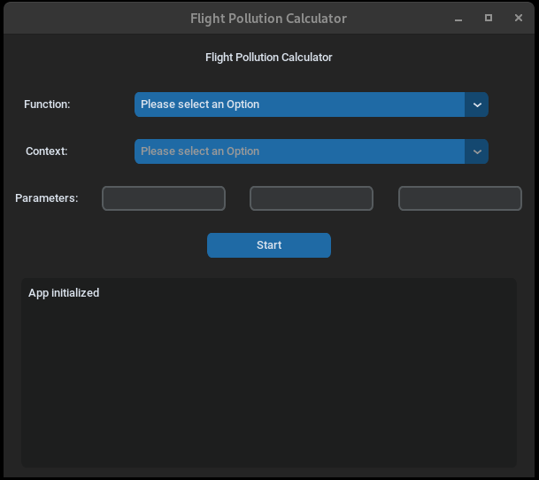
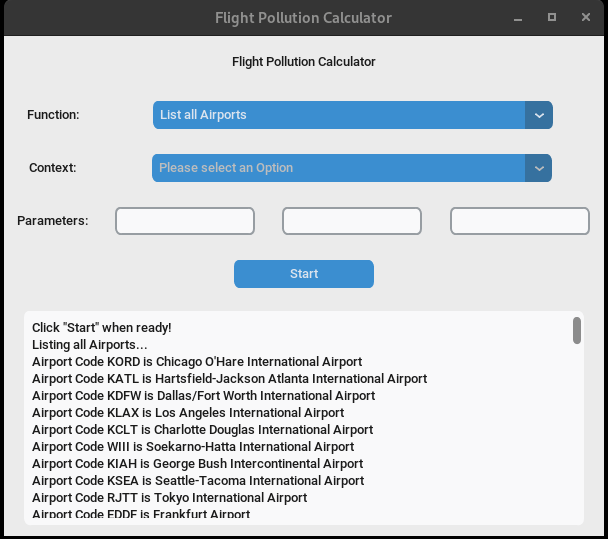

<h1 align="center"">CSD - CA2 - Group 4

<h2 align="center">CO2 emissions for Aviation Industry </h2>
<br>
<center>


</center>

<br>

GitHub Code Repository: **[CSD CA2 CO2 Emissions Project](https://github.com/NeiloErnesto89/CA2_CO2_EM)** 


<br><br>

# **Table of Content**

- [**Team Principles**](#team-principles)
- [**Project Introduction**](#project-introduction)
- [**Project Scope**](#project-scope) 


## **Team Principles**

A list of core principles guiding the project and the teams workload:

> 1.	Respect for one another: Basically respect each others time, private lives, deadlines etc. If we cannot attend meetings etc., just try and communicate that. 
> 2.	Communicate: Everyone is here to learn, ask questions, please avoid judgement and try help one another
> 3.    Etc. etc.


## **Project Introduction** 

"Our team has beem hired by a climate change NGO to develop an application to track, analyse and provide insights regarding CO2 emissions by the aviation industry"


## **Project Scope**

Built in Python using the Flask/Django framework etc.


> 1.	Django:  Django project backend by a relational database to create a website that allows users to track, calculate and analyse data records CO2 emissions by the aviation industry.
> 2.	Backend: Python
> 3.    Frontend: HTML


# Deployment

### Recommendation
1. Recommendation is to deploy in an UNIX environment, but Windows should be work (not tested)
2. Create a new folder and deploy the app in that folder

### Installation
1. Deploy the code from GitHub:
    ~~~bash
    git pull https://github.com/NeiloErnesto89/CA2_CO2_EM.git .
    ~~~
2. Install dependencies with the following command:
    ~~~bash
    pip install -r requirements.txt
    ~~~
3. Sign-up for a free API at: https://airlabs.co/
4. Sign-up for a free API at: https://aviationstack.com/
5. Create a file with name ```keys.py``` and add the following by replacing APIKEY with the keys created with steps 3 and 4:
    ~~~bash
    AIRLABS_KEY = "APIKEY"
    AVIATION_KEY = "APIKEY"
    ~~~

### Run the App!
~~~bash
python App.py
~~~

<br>

# Credits

## Data Sources
- <a href="https://aviationstack.com/"></a>
    - Flight tracker & airport timetable data web service trusted by 5.000+ of the smartest companies

- <a href="https://airlabs.co/"></a>
    - Real-time Flight Status & Global Aviation Database

<br>

## Contributors
- L00177585, patrickpulfer
- L00177516, bloobsky
- L00177808, davidryan-316
- L00177606, NeiloErnesto89

<br>

## Technologies Used
This application has been built by using the following technologies:

- <a href="https://www.python.org/"></a>
    - Python is a programming language that lets you work quickly and integrate systems more effectively.
- Python Packages:
    - [CustomTkinter](https://github.com/TomSchimansky/CustomTkinter) is a python UI-library based on Tkinter
    - [Haversine](https://github.com/mapado/haversine) to calculate the distance (in various units) between two points on Earth using their latitude and longitude
    - [NumPy](https://github.com/numpy/numpy) is a fundamental package for scientific computing with Python
    - [Pandas](https://github.com/pandas-dev/pandas) is a Python package that provides fast, flexible, and expressive data structures designed to make working with "relational" or "labeled" data both easy and intuitive.
<br><br>
- see [requirements.txt](https://github.com/patrickpulfer/Code-Institute-M4/blob/main/requirements.txt) for full list!
